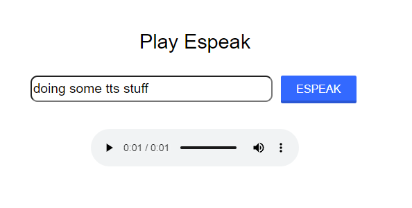

An practical example using [Django](https://www.djangoproject.com/) with [django-rq](https://github.com/rq/django-rq) to show results of a long running process. In this case, it runs `espeak` (text-to-speech) from an input field, then outputs the sound file as an mp3 (embedded audio) in the web interface.

Using `espeak` here is arbitrary, it could be any "long" process. For example: image processing, video conversion, batch processing, etc.



There's a lot of documentation for each of the components used here, but I couldn't find a practical example so I figured I'd make one. Needless to say this is just a development example so don't assume the deployment strategy is production-ready.

## Installation
```
docker-compose up -d
```
then browse to
```
http://hostip:7777
```
## Monitor the Redis Queue
```
docker logs name_of_rq_container --follow
